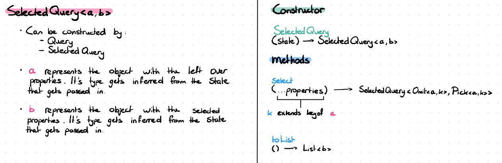

### TSL (Type Safe LINQ)

A small system in which data can be easily retrieved by querying in a type safe manner. This is the [assignment](https://github.com/hogeschool/Software-Engineering-Minor/blob/master/Projects/project2%20-%20mini%20typesafe%20LINQ%20to%20SQL.md) regarding the third year minor Software Engineering at the Hogeschool Rotterdam.

#### Preface: Thinking out loud

A good way yo start of is by brainstorming. In this session all problems, questions and thoughts were documented on paper to get a clearer view of the assignment.

#### Fase 1: Select

The first step was to think in terms of a category. This category, in which there is movement by morphisms, has been carefully designed to be as simple as possible.

 

The `Query<a>` type in more depth

 

The `SelectedQuery<a,b>` type in more depth

 

#### Fase 2: Include
...